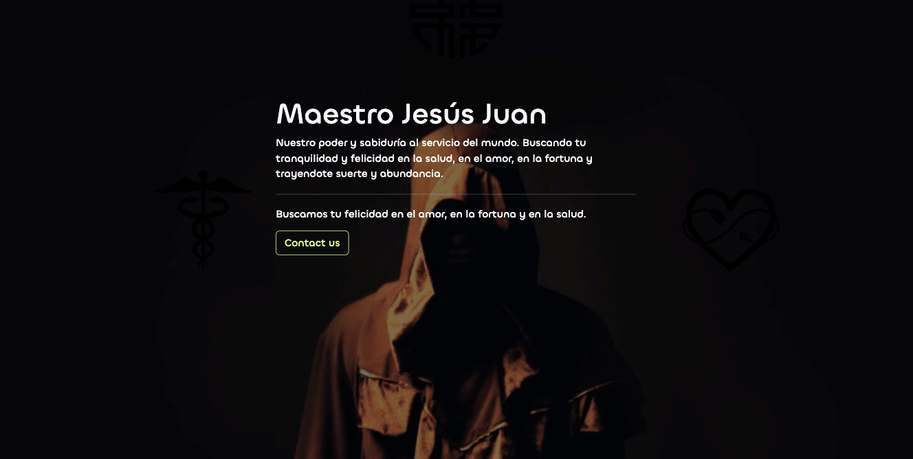

#  Maestro Jesus Juan Landing-Page
​
## Overview
Landing page to manage information about Maestro Jesus Juan, him services and contact users.
​​​
## Work flow
* Upload code in the repository.
* Create PULL REQUEST by sections:
    * 1 commit per feature (preferably), with a message regarding the feature.
​
        Ex: 
        
        Adding main banner. Once the feature is finished -> `create pull request` -> ``wait for feedback`` -> ``fix feedback`` -> ``close history`` -> ``start new task``
​

​
​## Table of Contents

- [Installation](#installation)
- [Features](#features)
- [Contributing](#contributing)
- [Team](#team)
- [Support](#support)
- [License](#license)

#### Follow me ��
​
| Authors | GitHub | Twitter | Linkedin |
| :---: | :---: | :---: | :---: |
| Carlos Andres Murcia Muñoz | [Charliemur2](https://github.com/Charliemur2) | [@charliesoka](https://twitter.com/charliesoka?lang=es) | [Carlos Andres Murcia Muñoz](https://www.linkedin.com/in/carlos-andres-murcia-munoz/) |
---

## Support

---

## License

Free Source Code

##### Carlos Murcia
##### August, 2023.